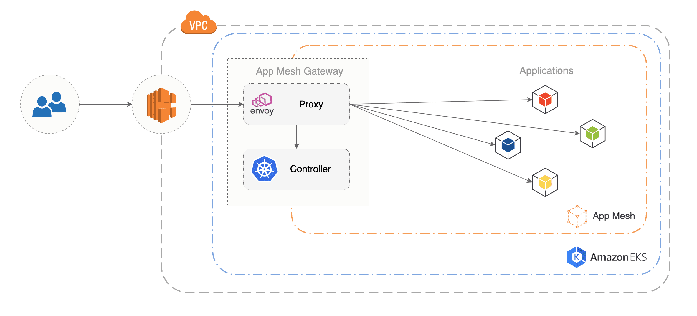

# appmesh-gateway
[](https://github.com/stefanprodan/appmesh-gateway/actions)
[](https://goreportcard.com/report/github.com/stefanprodan/appmesh-gateway)
[](https://github.com/stefanprodan/appmesh-gateway/releases)

App Mesh Gateway is an edge L7 load balancer that exposes applications outside the mesh.

Features:
* allows binding a public domain to an internal mesh address
* allows setting retries polices and timeouts for each service
* exports metrics in Prometheus format (request rate, error rate and latency)
* provides access logging for ingress traffic
* tags incoming requests and facilitates distributed tracing 
* allows running canary deployments and A/B testing with [Flagger](https://flagger.app) 
for user-facing web applications and APIs

The gateway is composed of:
* [Envoy](https://www.envoyproxy.io/) proxy
* Envoy control plane (xDS gRPC server)
* Kubernetes controller (service discovery)



An application running on App Mesh can be exposed outside the mesh by annotating its virtual service with:

```yaml
apiVersion: appmesh.k8s.aws/v1beta1
kind: VirtualService
metadata:
  name: frontend.test
  annotations:
    gateway.appmesh.k8s.aws/expose: "true"
    gateway.appmesh.k8s.aws/retries: "5"
    gateway.appmesh.k8s.aws/timeout: "25s"
    gateway.appmesh.k8s.aws/domain: "frontend.example.com"
```

If you want to expose the service inside the Kubernetes cluster you can omit the domain annotation.
By default the gateway exposes a virtual service by its name,
a service can be accessed by setting the host HTTP header e.g.:
```sh
curl -H 'Host: frontend.test' http://<gateway-host>/
```

The gateway registers/de-registers virtual services automatically as they come and go in the cluster.

## Install

Requirements:
* App Mesh CRDs, controller and inject [installed](https://github.com/aws/eks-charts#app-mesh)
* A mesh called `appmesh`

Install the API Gateway as NLB in `appmesh-gateway` namespace:

```sh
kubectl apply -k github.com/stefanprodan/appmesh-gateway//kustomize/appmesh-gateway-nlb
```

To run the gateway behind an ALB you can install the NodePort version:

```sh
kubectl apply -k github.com/stefanprodan/appmesh-gateway//kustomize/appmesh-gateway-nodeport
```

Wait for the deployment rollout to finish:

```sh
kubectl -n appmesh-gateway rollout status deploy/appmesh-gateway
```

When the gateway starts it will create a virtual node. You can verify the install with:

```text
watch kubectl -n appmesh-gateway describe virtualnode appmesh-gateway

Status:
  Conditions:
    Status:                True
    Type:                  VirtualNodeActive
```

## Example

Deploy podinfo in the `test` namespace:

```sh
kubectl -n test apply -k github.com/stefanprodan/appmesh-gateway//kustomize/test
```

Port forward to the gateway:

```sh
kubectl -n appmesh-gateway port-forward svc/appmesh-gateway 8080:80
```

Access the podinfo API by setting the host header to `podinfo.test`:

```sh
curl -vH 'Host: podinfo.test' localhost:8080
```

Access podinfo on its custom domain:

```sh
curl -vH 'Host: podinfo.internal' localhost:8080
```

Access podinfo using the gateway NLB address:

```sh
URL="http://$(kubectl -n appmesh-gateway get svc/appmesh-gateway -ojson | \
jq -r ".status.loadBalancer.ingress[].hostname")"

curl -vH 'Host: podinfo.internal' $URL
```

## Contributing

App Mesh Gateway is Apache 2.0 licensed and accepts contributions via GitHub pull requests.
